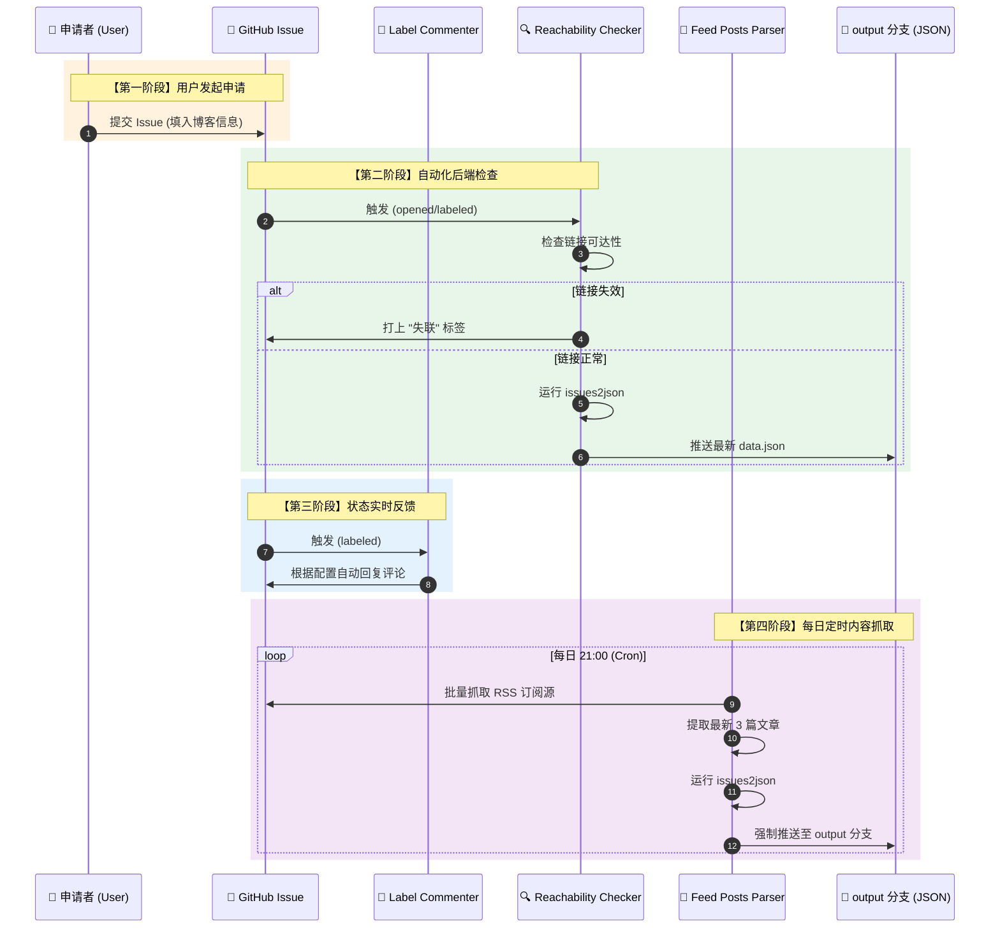

## 前言  

今天是周六，本该上学的，但是最近有很多学习上的事情压在身上，决定放纵一天，好好的休息一下  
游戏已经玩腻了，翻看着Steam的游戏库，却不知从何下手  

## 游戏
在以前，我天真认为游戏是我这辈子遇到过最好的消遣手段，一辈子也不会放下  
但是直到今天，我开始思考，游戏对生活有什么作用呢？  
玩了很多的游戏，但是没有发现什么作用，FPS类的游戏只会让自己的心情变得不愉悦  


#### Minecraft  

Minecraft是我小时候最喜欢玩的一款游戏，游戏时长也肯定突破了一千小时的大关  

可是随着年龄的增长，结实到的朋友也更加成熟，我开始逐渐抛弃了Minecraft  
这个承载着我童年回忆的游戏，一点一点的淡出了我的视线，有时候没有事情干了，就一个人开个存档，漫无目的的玩一会，也就退出了游戏  

随着朋友的引导，我接触到了CSGO这款游戏  

#### CSGO  

当初刚刚接触的时候是初一，男孩子嘛，总归是对枪战类游戏有独特的兴趣  
从刚刚接触时候的欣喜，到后来每一局游戏都以胜利为目的，经常和队友闹得很不愉快  

****  

  
从小玩到大的游戏，刚开始因为账号总是会忘记，所以接连换了好几个号，等到稳定下来之后，回看这么几个号的游戏时长也要接近一千小时大关了  

从CSGO到CS2，一转眼陪着这个游戏经历了一个大版本的更新  

以前的我，只能用玩物丧志形容才不为过  

#### 游戏对我的影响  

显然，对于我来说，我经常玩的这些游戏对我的生活可谓是没有任何的积极影响  
也体现在我的学业上  
初中三年，我一直沉浸在游戏的世界里，家里给我报了补习班也是时刻想着快点熬完一个半小时回家打游戏  
直到中考的时候，我意识到不学好像真的上不了高中了  

我在最后一个月猛学，最后好歹考上了一个正常的普通高中，心中那块悬着的巨石也同时落地了  

我所在的小县城只有三所普通的汉族高中，所谓普通高中也就是除了职校和私人高中外的公立学校  
当然，由于我初中三年几乎全都用在游戏上了，也无暇顾及学习，理所应当的就是上了需要分数最低的普通高中  

****  

**回望过去，发现如果不是沉迷游戏，也不至于到今天这么狼狈的地步**  

#### 近期  

近期，我在我和朋友们的群聊中发言频率明显降低了，因为我发现一旦我不玩游戏，真的没有什么话题好聊的  
最近他们在玩一款新的游戏，叫卡拉比丘，我就偶尔听到过这个游戏的名字，也没了解过  
前些阵子也有些蠢蠢欲动，但是想想，还有一百天高考了，游戏对我的魅惑力反而没有那么大了  

---

## 博客方面  

由于脱离了游戏，我学习的闲暇之余多出来了很多时间可以支配，我选择了躺在床上听爽文小说  
但是最近想着博客搁置了很久，许多博友的往来渐渐减少，也想着在不耽误学习的情况下多发表一些文章来寄存一些情绪  

#### 博客框架

2026新年新气象，原本的[Valaxy框架](https://valaxy.site/)是一个新进框架，虽然各种性能表现都很优秀但是兼容性和社区表现却不尽如人意  

困扰我多时的nodejs问题接踵而至，我当时甚至一度不敢更改我Valaxy博客的文件，生怕哪天他“罢工”给我看  
当时的处境是在生成博客文件时会有很多的报错，我也无心解决，既然不耽误正常使用就先这么样吧  

但是时间久了就发现了很多问题，比如在Valaxy时代的时候我的博客主页点击文章卡片没有反应，只有点击文章标题才可以进入文章页面  
各种配套插件稀少，只能靠自己编辑vue文件来完成  
这显然不是我想要的  

索性一不做二不休，趁着最近时间宽裕，花了一个下午把博客换成了Hexo框架  
不得不说，Hexo的完美生态链做到了配置文件中一目了然的配置，博客核心和插件都在/_conmfig.yml文件中  
而主题的插件也是都在/themes/hexo-theme-stellar/_conmfig.yml文件中  
结构清晰整洁，让我节省了不少的时间，也降低了我的试错成本  

#### 配套设施

得益于Hexo的优秀生态链  
我本以为配置会比较复杂繁琐，结果只是在配置文件里动动手指的事让我很开心  

例如我的链接跳转页面，很早我就知道大佬[Liu神](https://liushen.fun)曾开发过一套开源的Hexo-Safe-Go插件  
也就是动动手指的功夫就安装好了  

配置文件也是超级简单的在/_config.yml文件中添加以下内容  

```yml
# hexo-safego安全跳转插件
# see https://blog.liushen.fun/posts/1dfd1f41/
hexo_safego:
  # 基本功能设置
  general:
    enable: true                # 启用插件
    enable_base64_encode: true  # 使用 Base64 编码
    enable_target_blank: true   # 从新窗口打开跳转页面

  # 安全设置
  security:
    url_param_name: 'url'         # URL 参数名
    html_file_name: 'go.html'   # 重定向页面的文件名
    ignore_attrs:               # 忽略处理的 HTML 结构
      - 'data-fancybox'

  # 容器与页面设置
  scope:
    # apply_containers:           # 应用的容器选择器
      # - '#article-container'
    apply_pages:                # 应用的页面路径
      - "/"

    exclude_pages:              # 排除的页面路径

  # 域名白名单
  whitelist:
    domain_whitelist:           # 允许的白名单域名，通过字符串匹配实现
      - "xscnet.cn"
      - "xscnas.top"
      - "liushen.fun"
      - "koxiuqiu.cn"
      - "beian.miit.gov.cn"
      - "blogscn.fun"
      - "foreverblog.cn"
      - "travellings.cn"
      - "travel.moe"

  # 页面外观设置
  appearance:
    avatar: https://img.xscnet.cn//i/2025/10/30/6903707e73637.png    # 跳转页面头像路径
    title: "跳转中..."            # 跳转页面标题
    subtitle: "安全跳转"         # 跳转页面副标题
    darkmode: auto              # 是否启用深色模式
    countdowntime: 10            # 跳转页面倒计时秒数，如果设置为负数则为不自动跳转

  # 调试设置
  debug:
    enable: false               # 启用调试模式
```


#### 友链方案  

在以前添加友链一直困扰着我，总不能每次为了添加那么一行的链接都得先打开本地IDE然后git push吧  
于是我就用最简单的html+nodeserver做了一个简单的友链管理界面，负责在我服务器内的json文件中增删链接  
但是美中不足的就是每次服务器因为一些事情重启，就需要手动开启后端server服务  

直到我遇到了现在的这个主题  

让我最震惊的是这个主题的作者不光想到了主题的美化，甚至还有自动化友链的成熟方案  
[xauxuu 友链+友链文章聚合显示](https://xaoxuu.com/wiki/stellar/tag-plugins/data/#%E5%8F%8B%E9%93%BE-%E5%8F%8B%E9%93%BE%E6%96%87%E7%AB%A0%E8%81%9A%E5%90%88%E6%98%BE%E7%A4%BA)  
通过Github Action+Github issues的配合，只需要把Github仓库当作一个成品管理面板，就可以快捷的审核+添加友链  
这个思路是我从未想到过的  

具体实现步骤如下：  



不得不佩服，一套及其完整的逻辑反馈框架，甚至做到了“开箱即用”的方式  
我在此基础上加了一个自动同步到我阿里云服务器的Action，因为大部分博友网络环境为境内网络，使用Github文件的方式极其不稳定，所以用到了当data.json文件更新后，Action会自动使用SSH链接服务器，并把文件同步至服务器的api下  
所以目前可以做到了即时更新的效果，不过添加友链不会触发RSS拉取，只能等到每天晚上的自动拉取或我手动触发Action  

这套框架我最喜欢的地方是，在Github issues内添加的标签会同步给友链页面，如  
  
  

并且刚刚提交的友链会自带“审核中”标签，等到我审核完毕后，撤销标签Action会自动添加进json文件并推送至服务器  

我一直认为GithubAction只可能胜任一些小的部署项目，例如[我的博客部署](https://www.xscnet.cn/posts/p3120260303/)工作流，但我看到了这个框架作者开发的这么一套流程，确实是刘姥姥进了大观园一般  

避坑点：
1. 需要手动设置issues的标签，包括但不限于"审核中","白名单"
2. 若是新建仓库可能需要更改Label Commenter的执行权限，否则Action Bot无法添加回复(详细代码见下)  
3. .github/configs/label-commenter-config.yml里面的跳转链接需要手动更改一下  

我更改的一些GithubAtion代码  
```yml
name: Feed Posts Parser

on:
  workflow_dispatch: # Allows manual triggering
  schedule:
    # 每天凌晨5点运行一次
    - cron: '0 21 * * *' # Runs daily at 21:00

jobs:
  feed-parser:
    runs-on: ubuntu-latest
    permissions:
      issues: write
      contents: write
    steps:
      - name: Checkout repository
        uses: actions/checkout@v4
      - name: Run Feed Post Parser
        uses: xaoxuu/feed-posts-parser@main
        env:
          GITHUB_TOKEN: ${{ secrets.GITHUB_TOKEN }}
        with:
          posts_count: 3 # 取 3 篇文章
      # 重新生成一下JSON
      - name: Generate data.json
        uses: xaoxuu/issues2json@main
        env:
          GITHUB_TOKEN: ${{ secrets.GITHUB_TOKEN }}
        with:
          sort: 'posts-desc'
          exclude_issue_with_labels: '审核中, 风险网站' # 具有哪些标签的issue不生成到JSON中
          hide_labels: '白名单' # 这些标签不显示在前端页面
      - name: Setup Git Config
        run: |
          git config --global user.name 'github-actions[bot]'
          git config --global user.email 'github-actions[bot]@users.noreply.github.com'
      - name: Commit and Push to output branch
        run: |
          git fetch origin output || true
          git checkout -B output
          git add --all
          git commit -m "Update data from issues" || echo "No changes to commit"
          git push -f origin output
      # 添加这个新步骤来触发同步
      - name: Trigger Aliyun Sync
        if: success()  # 只在推送成功后触发
        run: |
          curl -X POST \
            -H "Accept: application/vnd.github.v3+json" \
            -H "Authorization: token ${{ secrets.PAT_TOKEN }}" \
            https://api.github.com/repos/${{ github.repository }}/dispatches \
            -d '{"event_type":"trigger-sync"}'
      # 发送统一的通知邮件（简化版）
      - name: Send notification email
        if: always()
        uses: dawidd6/action-send-mail@v3
        with:
          server_address: smtp.qq.com
          server_port: 465
          secure: true
          username: ${{ secrets.MAIL_USERNAME }}
          password: ${{ secrets.MAIL_PASSWORD }}
          subject: ${{ job.status == 'success' && '✅' || '❌' }} Feed订阅更新 ${{ github.workflow == 'Feed Posts Parser' && '文章' || '友链' }} - ${{ github.event.repository.updated_at || '手动触发' }}
          to: ${{ secrets.MAIL_TO }}
          from: GitHub Actions
          body: |
            🤖 定时任务执行报告
      
            📦 仓库: ${{ github.repository }}
            🔄 任务: ${{ github.workflow }}
            🆔 运行ID: ${{ github.run_id }}
            ⏱️ 执行时间: ${{ github.event.repository.updated_at || github.event.schedule || '手动触发' }}
      
            📊 最终状态: ${{ job.status == 'success' && '✅ 成功' || '❌ 失败' }}
      
            🔗 查看详情: https://github.com/${{ github.repository }}/actions/runs/${{ github.run_id }}
      
            ---
            本邮件由 GitHub Actions 自动发送
```
为.github/workflows/feed-posts-parser.yml添加了邮件通知和同步事件触发，所谓同步事件就是触发同步文件到服务器的Action  

```yml
name: Label Commenter

on:
  issues:
    types:
      - labeled
      - unlabeled

permissions:
  actions: read
  checks: read
  contents: read
  deployments: read
  issues: write
  discussions: read
  packages: read
  pages: read
  pull-requests: write
  repository-projects: read
  security-events: read
  statuses: read

jobs:
  comment:
    runs-on: ubuntu-latest
    steps:
      - uses: actions/checkout@v3

      - name: Label Commenter
        uses: peaceiris/actions-label-commenter@v1
        with:
          github_token: ${{ secrets.GITHUB_TOKEN }}
          config_file: .github/configs/label-commenter-config.yml
```
不知道是不是Github的新政策，新的仓库需要有权限说明Action-Bot才能在issue添加回复  

.github/workflows/reachability-checker.yml
```yml
name: Reachability Checker

# Controls when the workflow will run
on:
  issues:
    # 新增（打开）/关闭/重新打开/设置标签/移除标签
    types: [opened, closed, reopened, labeled, unlabeled]
  # 手动触发
  workflow_dispatch:
  # 每天凌晨4点运行一次
  schedule:
    - cron: '0 20 * * *'

# A workflow run is made up of one or more jobs that can run sequentially or in parallel
jobs:
  # This workflow contains a single job called "build"
  reachability-checker:
    # The type of runner that the job will run on
    runs-on: ubuntu-latest
    permissions:
      contents: write
      issues: write
    # Steps represent a sequence of tasks that will be executed as part of the job
    steps:
      - name: Checkout repository
        uses: actions/checkout@v4
      # 检查链接状态
      - name: Check Reachability
        uses: xaoxuu/links-checker@main
        env:
          GITHUB_TOKEN: ${{ secrets.GITHUB_TOKEN }}
        with:
          checker: 'reachability'
          unreachable_label: '失联'
          exclude_issue_with_labels: '审核中, 白名单' # 具有哪些标签的issue不进行检查
      # 检查完毕后重新生成一下JSON
      - name: Generate data.json
        uses: xaoxuu/issues2json@main
        env:
          GITHUB_TOKEN: ${{ secrets.GITHUB_TOKEN }}
        with:
          sort: 'posts-desc'
          exclude_issue_with_labels: '审核中, 风险网站' # 具有哪些标签的issue不生成到JSON中
          hide_labels: '白名单' # 这些标签不显示在前端页面
      - name: Setup Git Config
        run: |
          git config --global user.name 'github-actions[bot]'
          git config --global user.email 'github-actions[bot]@users.noreply.github.com'
      - name: Commit and Push to output branch
        run: |
          git fetch origin output || true
          git checkout -B output
          git add --all
          git commit -m "Update data from issues" || echo "No changes to commit"
          git push -f origin output
      # 添加这个新步骤来触发同步
      - name: Trigger Aliyun Sync
        id: trigger-sync
        if: success()
        continue-on-error: true
        env:
          PAT_TOKEN: ${{ secrets.PAT_TOKEN }}
        run: |
          HTTP_RESPONSE=$(curl -s -w "%{http_code}" -X POST \
            -H "Accept: application/vnd.github.v3+json" \
            -H "Authorization: token $PAT_TOKEN" \
            https://api.github.com/repos/${{ github.repository }}/dispatches \
            -d '{"event_type":"trigger-sync"}' \
            -o response.txt)
    
          if [ "$HTTP_RESPONSE" = "204" ]; then
            echo "status=success" >> $GITHUB_OUTPUT
          else
            echo "status=failure" >> $GITHUB_OUTPUT
            exit 1
          fi
```
同样是添加了同步触发  

.github/workflows/sync-to-aliyun.yml
最主要的还是这个了  
```yml
name: Sync to Aliyun Server

on:
  repository_dispatch:
    types: [trigger-sync]  # 自定义事件类型
  workflow_dispatch:
  push:
    branches:
      - output
    paths:
      - 'v2/data.json'

jobs:
  sync-to-aliyun:
    runs-on: ubuntu-latest
    steps:
      - name: Checkout output branch
        uses: actions/checkout@v4
        with:
          ref: output
          fetch-depth: 1
      
      - name: Verify data.json exists
        run: |
          if [ -f "v2/data.json" ]; then
            echo "✅ data.json found, size: $(wc -c < v2/data.json) bytes"
            echo "File preview:"
            head -n 5 v2/data.json
          else
            echo "❌ Error: v2/data.json not found!"
            exit 1
          fi
      
      - name: Sync file to Aliyun server via SCP
        uses: appleboy/scp-action@v0.1.7
        id: scp-sync
        with:
          host: ${{ secrets.ALIYUN_HOST }}
          username: ${{ secrets.ALIYUN_USERNAME }}
          key: ${{ secrets.ALIYUN_SSH_KEY }}
          port: ${{ secrets.ALIYUN_PORT }}
          source: "v2/data.json"
          target: "/home/linksdata/"
          strip_components: 1  # 移除v2/目录前缀，直接将data.json放到目标目录
          overwrite: true
          rm: false
      
      - name: Verify sync status
        run: |
          echo "✅ Sync completed successfully"
          echo "File synced to: /home/linksdata/data.json"
      
      - name: Send success email notification
        if: success()
        uses: dawidd6/action-send-mail@v3
        with:
          server_address: smtp.qq.com
          server_port: 465
          secure: true
          username: ${{ secrets.MAIL_USERNAME }}
          password: ${{ secrets.MAIL_PASSWORD }}
          subject: "✅ GitHub Actions: 友链数据同步成功"
          to: ${{ secrets.MAIL_TO }}
          from: GitHub Actions
          body: |
            GitHub Actions 友链数据同步任务执行成功！
            
            仓库: ${{ github.repository }}
            分支: ${{ github.ref }}
            触发时间: ${{ github.event.head_commit.timestamp }}
            提交信息: ${{ github.event.head_commit.message }}
            提交者: ${{ github.event.head_commit.author.name }}
            
            文件已同步到: /home/linksdata/data.json
            文件大小: $(wc -c < v2/data.json) 字节
            
            查看详情: https://github.com/${{ github.repository }}/actions/runs/${{ github.run_id }}
      
      - name: Send failure email notification
        if: failure()
        uses: dawidd6/action-send-mail@v3
        with:
          server_address: smtp.qq.com
          server_port: 465
          secure: true
          username: ${{ secrets.MAIL_USERNAME }}
          password: ${{ secrets.MAIL_PASSWORD }}
          subject: "❌ GitHub Actions: 友链数据同步失败"
          to: ${{ secrets.MAIL_TO }}
          from: GitHub Actions
          body: |
            GitHub Actions 友链数据同步任务执行失败！
            
            仓库: ${{ github.repository }}
            分支: ${{ github.ref }}
            触发时间: ${{ github.event.head_commit.timestamp }}
            
            请检查以下可能的原因：
            1. SSH连接问题（服务器是否在线？）
            2. 权限问题（目标目录是否存在且可写？）
            3. 文件路径问题（v2/data.json是否存在？）
            
            查看详细日志: https://github.com/${{ github.repository }}/actions/runs/${{ github.run_id }}
```
这是一个同步到阿里云服务器的GitHub Action，当触发器为`trigger-sync`时，会执行同步操作  
同步操作包括验证数据文件是否存在、使用SSH密钥将数据文件同步到服务器、验证同步状态、发送成功或失败的邮件通知  

---

## 小结  

这段时间开发新的框架令我很开心  
不仅收获了很多的东西，同时也让我有了独立解决问题的能力  
同时对于游戏这个东西 展示驱媚了哈哈哈  